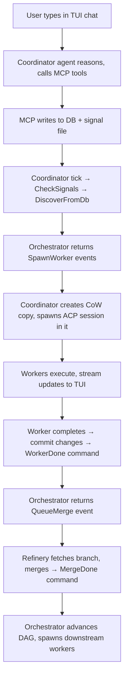

Enki is a Rust-based multi-agent coding orchestrator built around pure synchronous state machines. The orchestrator manages processes, state, and presentation — **it makes zero LLM API calls**.

## Four-Crate Architecture

Enki is organized into four crates with strict dependency direction: `cli` → `tui`, `acp`, `core`. No cycles.

<CardGroup cols={2}>
  <Card title="core" icon="gear">
    **Pure sync** state machine. Orchestrator, DAG scheduler, SQLite persistence, CoW copy manager, git merge refinery, roles, hashlines. Zero async, zero tokio.
  </Card>
  <Card title="acp" icon="robot">
    Async ACP client. Spawns agent subprocesses, manages sessions, routes streaming updates. All internal state is `Rc<RefCell<...>>` — **`!Send`**, must run on a `LocalSet`.
  </Card>
  <Card title="tui" icon="terminal">
    Sync terminal UI library over raw `crossterm` (not ratatui). Chat framework via `Handler<M>` trait. Optional `markdown` feature for `termimad`+`syntect` rendering.
  </Card>
  <Card title="cli" icon="code">
    The `enki` binary. No args → TUI. `enki mcp` → JSON-RPC stdio server. Houses the coordinator loop (`tokio::select!` on a dedicated OS thread with `current_thread` runtime + `LocalSet`).
  </Card>
</CardGroup>

## Core Design Principles

### DAG is the single source of truth

The in-memory DAG (via `Scheduler`) is the authoritative state for what's running, ready, blocked, paused, or cancelled. The SQLite database is **write-behind persistence** — state is written to DB for crash recovery and external visibility, but runtime decisions read from the DAG.

### Synchronous state machines in core

The `Orchestrator`, `Scheduler`, `MonitorState`, and `Dag` are all pure synchronous types. No async, no tokio, no ACP dependency in `core`. Every method is `fn handle(&mut self, cmd) -> Vec<Event>` — trivially testable.

### Coordinator is a thin async adapter

The CLI's `coordinator.rs` owns the tokio select loop, ACP sessions, and TUI channels. It translates async events (worker completions, TUI messages, merge results, timer ticks) into `Orchestrator::Command`s, and executes the resulting `Event`s (spawn workers, kill sessions, queue merges).

### Signal file protocol for cross-process communication

The MCP server runs as a separate process. It writes to the DB and drops JSON signal files in `.enki/events/`. The coordinator's tick loop picks these up via `Command::CheckSignals` and reacts accordingly.

## Orchestrator: Command/Event API

The orchestrator follows a pure command/event pattern. Commands come in, events go out.

```rust
pub enum Command {
    CreateExecution { steps: Vec<StepDef> },
    CreateTask { title, description, tier },
    WorkerDone(WorkerResult),
    MergeDone(MergeResult),
    RetryTask { task_id },
    Pause(Target),
    Resume(Target),
    Cancel(Target),
    StopAll,
    MonitorTick { workers },
    DiscoverFromDb,
    CheckSignals,
}

pub enum Event {
    SpawnWorker { task_id, title, description, tier, execution_id, step_id, upstream_outputs },
    KillSession { session_id },
    QueueMerge(MergeRequest),
    WorkerCompleted { task_id, title },
    WorkerFailed { task_id, title, error },
    MergeLanded { mr_id, task_id },
    MergeConflicted { mr_id, task_id },
    MergeFailed { mr_id, task_id, reason },
    ExecutionComplete { execution_id },
    ExecutionFailed { execution_id },
    AllStopped { count },
    MonitorCancel { session_id },
    MonitorEscalation(String),
    StatusMessage(String),
}

pub enum Target {
    Execution(String),
    Node { execution_id, step_id },
}
```

<Note>
The orchestrator's `handle()` method takes a `Command` and returns `Vec<Event>`. The coordinator executes those events in a cascade loop — spawning workers can fail and produce new events, so it drains in a `while !events.is_empty()` loop.
</Note>

## Data Flow

Here's how a typical workflow moves through Enki's architecture:



### Key Patterns

**Hashlines**: `read_text_file` tags each line with `{line_num:>width}:{xxh3_hash}|{content}`. `write_text_file` verifies anchors to detect stale edits. Implemented in `core/src/hashline.rs`.

**Two-phase worker completion**: Worker finishes (`WorkerDone`, frees tier slot) → merge runs → `MergeDone` advances DAG. The scheduler tracks both phases separately for concurrency accounting.

**Signal file IPC**: MCP server writes `.enki/events/sig-*.json`. Coordinator polls and deletes on each tick. No fsnotify.

**`infra_broken` flag**: If `cp` fails during worker spawn, coordinator auto-fails all subsequent spawns rather than retrying.

**Merger agent flow**: On merge conflict, `MergeNeedsResolution` spawns a separate ACP session with minimal tools working in a shared temp clone. `CleanupGuard` + `std::mem::forget` keeps the temp dir alive during resolution.

## Database Schema

SQLite (WAL mode) with auto-migration. DAG stored as JSON blob in executions table.

```sql
sessions         -- id, started_at, ended_at
tasks            -- id, session_id, title, description, status, tier, assigned_to, copy_path, branch, base_branch, timestamps
executions       -- id, session_id, status, dag (JSON blob), created_at
execution_steps  -- execution_id, step_id, task_id
task_dependencies -- task_id, depends_on
merge_requests   -- id, session_id, task_id, branch, base_branch, status, priority, diff_stats, timestamps
task_outputs     -- task_id, output
messages         -- id, from_addr, to_addr, subject, body, priority, msg_type, thread_id, timestamps
```

<Info>
Auto-migration runs on every DB open: `auto_migrate()` parses the schema const and `ALTER TABLE ADD COLUMN` for anything missing. No version files needed.
</Info>

## MCP Server

JSON-RPC 2.0 over stdio. Role-based tool filtering (planner gets all tools, worker gets status + list only).

**Available tools:**
- `enki_status` — task counts by status
- `enki_task_create` — create standalone task (writes DB + signal file)
- `enki_task_list` — list all tasks
- `enki_execution_create` — create multi-step execution with dependencies
- `enki_task_retry` — retry a failed task
- `enki_pause` — pause an execution or step
- `enki_cancel` — cancel an execution or step
- `enki_stop_all` — stop all running workers

**Signal file format:**
```json
{"type": "execution_created", "execution_id": "exec-..."}
{"type": "task_created", "task_id": "task-..."}
{"type": "pause", "execution_id": "exec-...", "step_id": "optional"}
{"type": "cancel", "execution_id": "exec-...", "step_id": "optional"}
{"type": "stop_all"}
```

## Environment Variables

| Variable | Purpose |
|----------|--------|
| `ENKI_BIN` | Path to own binary, injected into all subprocesses |
| `ENKI_DIR` | Project `.enki/` directory for DB + signal files |
| `ENKI_SESSION_ID` | Scopes MCP tool results to current session |
| `CLAUDECODE` | Cleared on agent spawn to prevent nested-session refusal |

## Next Steps

<CardGroup cols={2}>
  <Card title="DAG Execution" icon="sitemap" href="/concepts/dag-execution">
    Learn how the DAG scheduler evaluates dependencies and manages concurrency
  </Card>
  <Card title="Worker Isolation" icon="copy" href="/concepts/worker-isolation">
    Understand copy-on-write cloning and filesystem isolation
  </Card>
</CardGroup>