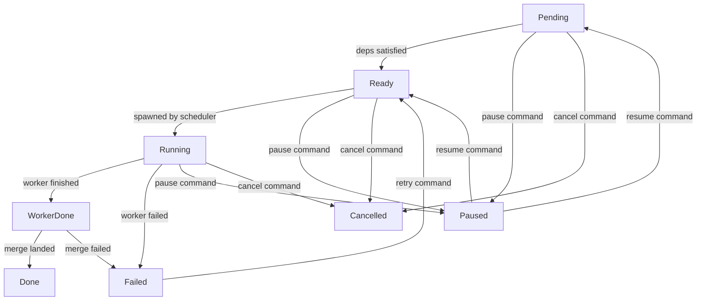

Enki uses a **directed acyclic graph (DAG)** to represent task dependencies within an execution. The scheduler evaluates ready nodes across all active executions and dispatches workers within tier-based concurrency limits.

## Node Statuses

Each node in the DAG tracks its execution state:

```rust
pub enum NodeStatus {
    Pending,      // Blocked by dependencies
    Ready,        // All dependencies satisfied, waiting for worker slot
    Running,      // Worker is executing
    WorkerDone,   // Worker finished, merge pending
    Done,         // Merge landed
    Failed,       // Worker or merge failed
    Blocked,      // Dependency failed (cascades)
    Paused,       // User-paused
    Cancelled,    // User-cancelled (cascades)
}
```

<Info>
**WorkerDone** is a critical intermediate state. When a worker finishes, the node transitions to `WorkerDone` (not `Done`). This frees the tier slot for other workers while the merge runs asynchronously. Once the merge lands, the node advances to `Done` and fires `Merged` edges.
</Info>

## Node State Transitions

Here's the full state machine:



<Note>
**Cancel cascades**: Cancelling a node also cancels all transitive dependents that are `Pending`, `Ready`, `Blocked`, or `Paused`. Done nodes are immune.

**Pause does not cascade**: Pausing a node only affects that node. Downstream nodes stay in their current state.
</Note>

## Edge Conditions: When Dependencies Fire

Dependencies between nodes can specify **when** they're satisfied. This enables overlapping execution.

```rust
pub enum EdgeCondition {
    Merged,    // Default: dep must be fully Done (worker + merge complete)
    Completed, // Dep's worker must have finished (WorkerDone or Done)
    Started,   // Dep just needs to be Running (or further)
}
```

### Example: Overlapping Test Execution

Suppose you have an implementation step and a test step. You want tests to start as soon as implementation begins writing code, not after the merge lands.

```rust
StepDef {
    id: "test",
    title: "Write tests",
    needs: vec![StepDep {
        step_id: "implement",
        condition: EdgeCondition::Started,
    }],
    ...
}
```

Timeline:
- `implement` transitions to `Running` → `test` becomes `Ready` immediately
- Both workers run in parallel
- When `implement` finishes and merges, `test` may still be running

<Tip>
Use `Started` edges for steps that can work in parallel (tests, documentation, linting). Use `Merged` (default) for steps that need the merged code (deployment, integration tests).
</Tip>

### Completed vs Merged

**Completed** fires when the worker finishes (node is `WorkerDone` or `Done`). This is useful for steps that need the worker's output but don't care about the merge:

```rust
StepDef {
    id: "review",
    title: "Review plan",
    needs: vec![StepDep {
        step_id: "design",
        condition: EdgeCondition::Completed,
    }],
    ...
}
```

The review step gets the design output immediately after the worker finishes, without waiting for the merge to land.

## Tier-Based Concurrency

The scheduler enforces concurrency limits per model tier:

```rust
pub struct Limits {
    pub max_workers: usize,  // Global worker limit (default: 10)
    pub max_light: usize,    // Light tier slots (default: 10)
    pub max_standard: usize, // Standard tier slots (default: 5)
    pub max_heavy: usize,    // Heavy tier slots (default: 5)
}
```

Each task has a complexity tier (light/standard/heavy) that determines:
1. Which model handles it
2. How many can run concurrently

<Warning>
A worker occupies its tier slot from `Running` until `WorkerDone`. The scheduler decrements the count when the **worker process exits**, not when the merge lands. This allows overlapping merges.
</Warning>

## Scheduler Tick Behavior

The scheduler's `tick()` method runs periodically (every 3 seconds by default). On each tick:

1. **Evaluate ready nodes** across all active executions
2. **Check tier limits** for each ready node's tier
3. **Mark nodes as Running** if slots are available
4. **Return SpawnWorker actions** for the coordinator to execute
5. **Emit TaskBlocked** for newly blocked nodes (dependency failed)
6. **Check for completion**: emit `ExecutionComplete` or `ExecutionFailed`

The coordinator executes the actions, spawns ACP workers, and waits for the next tick.

## Declaring Dependencies

When creating an execution, you define steps with their dependencies:

```rust
Command::CreateExecution {
    steps: vec![
        StepDef {
            id: "design",
            title: "Design the feature",
            description: "Think through architecture",
            tier: Tier::Heavy,
            needs: vec![],  // No dependencies (root node)
            checkpoint: false,
            role: None,
        },
        StepDef {
            id: "implement",
            title: "Implement the feature",
            description: "Write code",
            tier: Tier::Standard,
            needs: vec![StepDep {
                step_id: "design",
                condition: EdgeCondition::Merged,  // Wait for design merge
            }],
            checkpoint: false,
            role: Some("feature_developer"),
        },
        StepDef {
            id: "test",
            title: "Write tests",
            description: "Add test coverage",
            tier: Tier::Light,
            needs: vec![StepDep {
                step_id: "implement",
                condition: EdgeCondition::Started,  // Start when impl starts
            }],
            checkpoint: false,
            role: None,
        },
    ],
}
```

<Accordion title="What happens with this DAG?">
1. `design` spawns immediately (no dependencies)
2. When `design` worker finishes and merge lands → `design` is `Done`
3. `implement` becomes `Ready` and spawns (if tier slot available)
4. As soon as `implement` transitions to `Running`, `test` becomes `Ready` and spawns
5. Both `implement` and `test` run in parallel
6. When both finish and merge → execution is complete
</Accordion>

## Pause, Resume, Cancel

### Pause

- **Execution-level**: `Pause(Target::Execution(exec_id))` — scheduler skips this execution on all future ticks. Running workers continue, but no new workers spawn.
- **Node-level**: `Pause(Target::Node { execution_id, step_id })` — pauses just that node. If `Running`, the coordinator kills the worker. If `Ready`/`Pending`, it stays paused.

### Resume

- **Execution-level**: `Resume(Target::Execution(exec_id))` — execution re-enters the scheduler. Next tick evaluates ready nodes.
- **Node-level**: `Resume(Target::Node { execution_id, step_id })` — re-evaluates dependencies. If satisfied → `Ready`, else → `Pending`.

### Cancel

- **Execution-level**: `Cancel(Target::Execution(exec_id))` — cancels all nodes and removes the execution from the scheduler. Returns `(task_id, session_id)` pairs for running workers the coordinator must kill.
- **Node-level**: `Cancel(Target::Node { execution_id, step_id })` — cancels the node and all transitive dependents.

## Upstream Outputs

When a node spawns, the scheduler collects outputs from all completed upstream dependencies and passes them to the worker:

```rust
Event::SpawnWorker {
    upstream_outputs: vec![
        ("Design".into(), "Designed a REST API with 3 endpoints...".into()),
    ],
    ...
}
```

The worker receives these as context to build on previous work.

<Tip>
**Output is captured per-step**: Workers can write to `task_outputs` via the DB. When the step completes, the scheduler retrieves the output and makes it available to dependents.
</Tip>

## Failure Propagation

When a node fails (`mark_failed`):

1. The node's status becomes `Failed`
2. All transitive dependents transition to `Blocked`
3. The scheduler emits `TaskBlocked` actions for newly blocked nodes
4. If no nodes are `Running`, `Ready`, or `Pending` → execution is `Failed`

**Retry**: `RetryTask { task_id }` resets a failed node and all its blocked dependents back to `Pending`, then re-evaluates. The node can be re-queued.

## Real-World Example

Here's a realistic multi-step execution with mixed edge conditions:

```rust
Command::CreateExecution {
    steps: vec![
        // Step 1: Research (artifact, no code)
        StepDef {
            id: "research",
            title: "Research the problem",
            tier: Tier::Heavy,
            needs: vec![],
            role: Some("researcher"),
            ...
        },
        // Step 2: Design (waits for research to complete, not merge)
        StepDef {
            id: "design",
            title: "Design the solution",
            tier: Tier::Heavy,
            needs: vec![StepDep {
                step_id: "research",
                condition: EdgeCondition::Completed,  // Research output needed
            }],
            role: Some("feature_developer"),
            ...
        },
        // Step 3: Implement (waits for design merge)
        StepDef {
            id: "implement",
            title: "Implement the feature",
            tier: Tier::Standard,
            needs: vec![StepDep {
                step_id: "design",
                condition: EdgeCondition::Merged,
            }],
            role: Some("feature_developer"),
            ...
        },
        // Step 4: Tests (start as soon as implementation starts)
        StepDef {
            id: "test",
            title: "Write tests",
            tier: Tier::Light,
            needs: vec![StepDep {
                step_id: "implement",
                condition: EdgeCondition::Started,
            }],
            role: Some("feature_developer"),
            ...
        },
        // Step 5: Review (waits for both impl and test to merge)
        StepDef {
            id: "review",
            title: "Review the PR",
            tier: Tier::Standard,
            needs: vec![
                StepDep { step_id: "implement", condition: EdgeCondition::Merged },
                StepDep { step_id: "test", condition: EdgeCondition::Merged },
            ],
            checkpoint: true,  // Pause execution for human review
            ...
        },
    ],
}
```

## Next Steps

<CardGroup cols={2}>
  <Card title="Worker Isolation" icon="copy" href="/concepts/worker-isolation">
    Learn how workers get isolated filesystem copies
  </Card>
  <Card title="Merge Queue" icon="code-merge" href="/concepts/merge-queue">
    Understand the refinery and conflict resolution
  </Card>
</CardGroup>