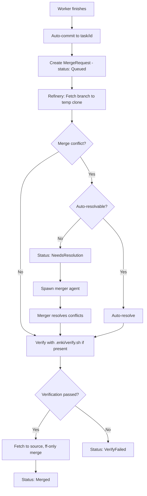
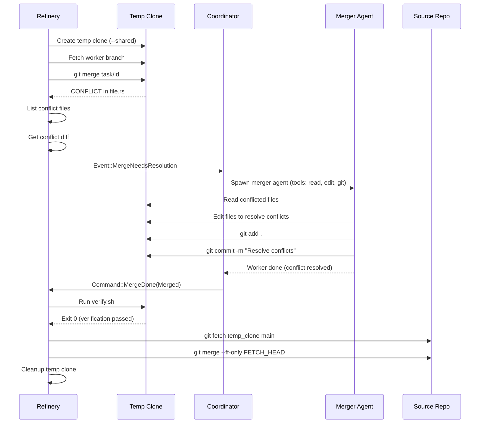

The **refinery** is Enki's merge queue processor. When a worker finishes, its changes are committed to a git branch, queued for merging, and processed by the refinery. The refinery handles rebasing, conflict detection, verification, and conflict resolution.

## Merge Request Lifecycle

When a worker completes successfully:

1. **Worker commits changes** to `task/<id>` branch in its copy
2. **Orchestrator creates a MergeRequest** in the DB with status `Queued`
3. **Refinery picks up the MR** and processes it
4. **Outcome**: `Merged`, `Conflicted`, `NeedsResolution`, `VerifyFailed`, or `Failed`



## MergeRequest Structure

Each merge request tracks:

```rust
pub struct MergeRequest {
    pub id: Id,                   // mr-...
    pub task_id: Id,              // Associated task
    pub branch: String,           // task/<id>
    pub base_branch: String,      // Usually "main"
    pub status: MergeStatus,      // Queued, Rebasing, Verifying, Merged, Conflicted, Resolving, Failed
    pub priority: i32,            // Higher = sooner (default: 2)
    pub diff_stats: Option<String>, // +10 -3 (2 files)
    pub review_note: Option<String>, // Conflict details or verify output
    pub execution_id: Option<Id>,
    pub step_id: Option<String>,
    pub queued_at: DateTime<Utc>,
    pub started_at: Option<DateTime<Utc>>,
    pub merged_at: Option<DateTime<Utc>>,
}

pub enum MergeStatus {
    Queued,      // Waiting for refinery
    Rebasing,    // Merging in temp clone
    Verifying,   // Running .enki/verify.sh
    Merged,      // Successfully merged
    Conflicted,  // Merge conflict, unresolvable
    Resolving,   // Merger agent is working on it
    Failed,      // Merge or verification failed
}
```

## Git-Based Merge (Source is a Git Repo)

For projects that are git repositories, Enki uses a **temp clone workflow** to keep the source working tree clean:

### Step 1: Create Temp Clone

The refinery creates a temporary shared clone of the source repo:

```bash
git clone --shared <source> .enki/copies/.merge-<mr_id>
```

`--shared` reuses the source repo's object store — fast and space-efficient. All merge work happens in this temp clone.

### Step 2: Fetch Worker Branch

Fetch the worker's branch from its copy into the temp clone:

```bash
cd .enki/copies/.merge-<mr_id>
git fetch <worker_copy> task/<id>:task/<id>
```

### Step 3: Merge

Checkout the default branch and merge the worker branch:

```bash
git checkout main
git merge task/<id> --no-edit
```

If the merge succeeds without conflicts → proceed to verification.

If the merge has conflicts → check if they're auto-resolvable or need an agent.

<Note>
**Three-way merge**: Git automatically resolves non-overlapping additions. If worker A adds file `a.rs` and worker B adds file `b.rs`, the merge succeeds without conflicts.
</Note>

### Step 4: Conflict Detection

If the merge fails, list conflicted files:

```bash
git diff --name-only --diff-filter=U
```

If there are conflicted files:

1. Get the conflict diff: `git diff`
2. **Emit `MergeNeedsResolution` event** with:
   - `temp_dir`: Path to the temp clone
   - `conflict_files`: List of conflicted file paths
   - `conflict_diff`: Full diff showing conflict markers
3. **Prevent temp clone cleanup** (`std::mem::forget(_cleanup)`)
4. **Spawn a merger agent** to work in the temp clone

<Info>
The temp clone is **kept alive** for the merger agent. When the merger finishes resolving conflicts, it commits the resolution, and the refinery picks up from step 5.
</Info>

### Step 5: Verification (Optional)

If `.enki/verify.sh` exists, run it in the temp clone:

```bash
bash .enki/verify.sh
```

**Exit code 0**: Verification passed → proceed to step 6.

**Non-zero exit**: Verification failed → emit `MergeOutcome::VerifyFailed` with stdout/stderr.

<Tip>
Use `verify.sh` for final checks before merge: run tests, linters, type-checkers, etc. If verification fails, the merge is rejected and the task fails.
</Tip>

### Step 6: Bring Result Back to Source

Fetch the merged result from the temp clone to the source repo:

```bash
cd <source>
git fetch .enki/copies/.merge-<mr_id> main
git merge --ff-only FETCH_HEAD
```

`--ff-only` ensures the source branch pointer just moves forward (no new merge commit). The real merge happened in the temp clone.

<Warning>
**The source working tree is never directly modified**. All merges happen in the temp clone. Only the final `--ff-only` updates the source branch pointer. Uncommitted changes in your working tree are preserved (git aborts if they conflict with the merge).
</Warning>

### Step 7: Cleanup

Delete the temp clone and the worker's task branch:

```bash
rm -rf .enki/copies/.merge-<mr_id>
git branch -D task/<id>
```

## Filesystem Merge (Source is Not a Git Repo)

For projects that aren't git repos (e.g., a directory of scripts), Enki uses a **filesystem merge**:

1. **Find the baseline commit** in the worker's copy (the "main" branch before the task branch)
2. **Get changed files**: `git diff --name-status <base> HEAD`
3. **Verify** (run `.enki/verify.sh` if present)
4. **Copy files back to source**:
   - **Added/Modified**: Copy file from worker copy to source
   - **Deleted**: Remove file from source
5. **Update MR status** to `Merged`

<Note>
Filesystem merges **don't detect conflicts** — they blindly overwrite. Use git-based projects if you need conflict detection.
</Note>

## MergeNeedsResolution: The Merger Agent

When a merge has conflicts that can't be auto-resolved, the refinery emits `Event::MergeNeedsResolution`. The coordinator:

1. **Spawns a merger agent** (ACP session with role `merger`)
2. **Gives the agent minimal tools** (`MERGER_TOOLS`): read files, edit files, run git commands
3. **Provides context**:
   - `temp_dir`: Where to work (the temp clone with conflict markers)
   - `conflict_files`: List of conflicted files
   - `conflict_diff`: Full diff showing `<<<<<<< HEAD` markers
4. **Agent resolves conflicts** by editing files and committing
5. **Agent finishes** → refinery picks up at step 5 (verification)

The merger agent works in the **same temp clone** the refinery created. Once conflicts are resolved and committed, the refinery fetches the result back to source.

<Tip>
**Merger agents are specialists**: They have a focused system prompt for conflict resolution and limited tools. They can't create new tasks or access the broader project context — just resolve the conflict and commit.
</Tip>

## Verify Script: `.enki/verify.sh`

The optional `.enki/verify.sh` script runs **after** the merge completes (in the temp clone for git projects, in the worker copy for non-git projects).

**Exit code 0**: Merge is accepted.

**Non-zero exit**: Merge is rejected, task fails.

### Example: Run Tests Before Merge

```bash
#!/usr/bin/env bash
set -euo pipefail

# Run the full test suite
cargo test --all

# Type-check
cargo check

# Lint
cargo clippy -- -D warnings
```

If any command fails, the merge is rejected with `MergeOutcome::VerifyFailed`.

<Warning>
**verify.sh runs in the temp clone** (for git projects). It sees the merged code, not your source working tree. Failures here block the merge from landing in your source repo.
</Warning>

## Conflict Resolution Flow

Here's a detailed look at how conflicts are handled:



## Merge Priority

Merge requests have a `priority` field (default: 2). Higher priority MRs are processed first. Use this to prioritize critical fixes over routine changes.

```rust
let mr = MergeRequest {
    priority: 5,  // High priority
    ...
};
```

<Info>
The refinery processes MRs in priority order (highest first), then by `queued_at` (oldest first).
</Info>

## Merge Outcomes

The refinery reports one of five outcomes:

### `MergeOutcome::Merged`

Merge succeeded, verification passed (if applicable), and the branch was merged into the source repo. The task is `Done`.

### `MergeOutcome::Conflicted(String)`

Merge had conflicts that couldn't be resolved (e.g., no merger agent available, or merger failed). The task is `Blocked`. The conflict detail is stored in `review_note`.

### `MergeOutcome::NeedsResolution { temp_dir, conflict_files, conflict_diff }`

Merge had conflicts that need an agent to resolve. The coordinator spawns a merger agent to work in `temp_dir`.

### `MergeOutcome::VerifyFailed(String)`

`.enki/verify.sh` exited non-zero. The task is `Failed`. Stdout/stderr from verify.sh is stored in `review_note`.

### `MergeOutcome::Failed(String)`

Something went wrong (git command failed, filesystem error, etc.). The task is `Failed`. Error detail is stored in `review_note`.

## Worker Output Without Merge: Artifact Mode

Roles with `output = "artifact"` (like `researcher`, `code_referencer`) **skip the refinery entirely**. Their output is saved to `.enki/artifacts/<exec>/<step>.md` and immediately made available to dependent steps via `upstream_outputs`.

No branch, no merge, no conflicts.

<Tip>
Use artifact mode for exploratory or read-only work. It's instant — no merge queue, no waiting for verification.
</Tip>

## Best Practices

<Note>
**Keep merges small**: The more changes in a branch, the higher the conflict risk. Break large tasks into smaller steps when possible.
</Note>

<Tip>
**Use verify.sh for critical checks**: If your project has tests, linters, or type-checkers, run them in verify.sh. This prevents broken code from landing in your source repo.
</Tip>

<Warning>
**Don't commit .enki/ to the source repo**: The `.enki/` directory (database, copies, event signals) is local state. Add it to `.gitignore`.
</Warning>

## Debugging Merge Failures

If a merge fails, check:

1. **MergeRequest in DB**: `SELECT * FROM merge_requests WHERE id = 'mr-...'`
   - Check `status` and `review_note` for error details
2. **Worker branch**: Does `task/<id>` have any file changes? (`git diff <base> task/<id>`)
3. **Conflict diff**: If `status = Conflicted`, `review_note` contains the conflict detail
4. **Verify output**: If `status = VerifyFailed`, `review_note` contains stdout/stderr from verify.sh

<Accordion title="What if verify.sh is flaky?">
If verify.sh sometimes fails due to non-determinism (e.g., race conditions in tests), consider:

- **Retry the task**: `Command::RetryTask { task_id }` will re-run the worker and re-attempt the merge.
- **Fix the flake**: Update verify.sh to handle retries or skip flaky tests temporarily.
- **Remove verify.sh**: If verification isn't critical, delete the script.
</Accordion>

## Next Steps

<CardGroup cols={2}>
  <Card title="Roles" icon="user-tag" href="/concepts/roles">
    Understand agent roles and output modes
  </Card>
  <Card title="Worker Isolation" icon="copy" href="/concepts/worker-isolation">
    Learn about copy-on-write cloning
  </Card>
</CardGroup>