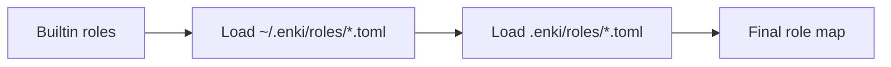

Enki's role system lets you assign specialized agent personas to tasks. Each role defines:

- A **system prompt** (the agent's instructions)
- Whether the agent **can edit files** (`can_edit: true/false`)
- The **output mode** (code changes on a branch, or a markdown artifact)

## Role Config Structure

Roles are defined in TOML files:

```toml
name = "feature_developer"
label = "Feature Developer"
description = "Implements new features, writes production code, adds tests. Output: code changes (branch)."
can_edit = true
output = "branch"  # or "artifact"

[system_prompt]
system_prompt = """
You are a feature developer. Your job is to implement the requested feature cleanly and completely.

## Phase 1: Explore
Before writing any code, build a thorough understanding...
"""
```

### Fields

| Field | Type | Description |
|-------|------|-------------|
| `name` | String | Unique identifier (e.g., `"researcher"`, `"bug_fixer"`) |
| `label` | String | Human-readable name (e.g., `"Researcher"`) |
| `description` | String | Short summary of the role's purpose |
| `system_prompt` | String | Full instructions sent to the agent |
| `can_edit` | Boolean | Whether the agent can modify project files (default: `true`) |
| `output` | String | `"branch"` (code changes) or `"artifact"` (markdown file, no merge) |

## Output Modes

Roles have one of two output modes:

### OutputMode::Branch

The agent produces **code changes** on a git branch. When the worker finishes:

1. Changes are committed to `task/<id>`
2. The refinery merges the branch into the default branch
3. Dependent steps receive the merged code

**Use cases**: Feature development, bug fixes, refactoring, test writing.

### OutputMode::Artifact

The agent produces a **markdown artifact** (no code changes). When the worker finishes:

1. Output is saved to `.enki/artifacts/<execution_id>/<step_id>.md`
2. No merge occurs (worker skips the refinery)
3. Dependent steps receive the artifact content as `upstream_outputs`

**Use cases**: Research, investigation, planning, external code lookups.

<Note>
**Artifact agents can't edit files**: Roles with `output = "artifact"` automatically have `can_edit = false`. Trying to edit files will fail.
</Note>

## Role Cascade: Builtin → Global → Project

Roles load in three layers:

1. **Builtin roles** (shipped with Enki)
2. **Global overrides** (`~/.enki/roles/*.toml`)
3. **Project overrides** (`<project>/.enki/roles/*.toml`)

Later layers override earlier ones **by name**. If you create `~/.enki/roles/researcher.toml`, it replaces the builtin `researcher` role.



<Tip>
**Per-project customization**: Drop a custom role in `.enki/roles/` to override just for that project. For example, a TypeScript project might customize `feature_developer` to emphasize type safety.
</Tip>

## Builtin Roles

Enki ships with five builtin roles:

<CardGroup cols={2}>
  <Card title="feature_developer" icon="code">
    Implements new features. Four-phase workflow: Explore, Design, Implement, Self-Review. Output: **branch**.
  </Card>
  <Card title="ralph" icon="arrows-rotate">
    Iterative verify-fix loop worker. Grinds through test failures until verification passes. Output: **branch**.
  </Card>
  <Card title="bug_fixer" icon="bug">
    Diagnoses root causes, writes surgical fixes and regression tests. Output: **branch**.
  </Card>
  <Card title="researcher" icon="magnifying-glass">
    Read-only investigation agent. Explores code, traces paths, reports findings. Output: **artifact**.
  </Card>
  <Card title="code_referencer" icon="github">
    Fetches external code from GitHub repos and docs. Read-only, cleans up after itself. Output: **artifact**.
  </Card>
</CardGroup>

### feature_developer

**Output**: `branch` | **Can edit**: `true`

A general-purpose coding agent. Follows a structured four-phase workflow:

1. **Explore**: Study existing code, find similar features, read docs
2. **Design**: Choose an approach, commit to it
3. **Implement**: Write production code, tests, handle errors
4. **Self-Review**: Re-read changes, check for bugs, simplify

Best for: New features, enhancements, refactors.

### ralph

**Output**: `branch` | **Can edit**: `true`

An iterative worker for tasks with clear programmatic success criteria (tests, builds, linters). Runs in a tight loop:

1. **Verify**: Run the check (tests, build, lint)
2. **Assess**: Read the output, identify the first failure
3. **Fix**: Make a minimal change to fix that failure
4. **Repeat**: Go back to step 1 until everything passes

Best for: Fixing test suites, resolving type errors, passing linters.

<Tip>
**Ralph is relentless**: He doesn't stop until verification passes clean. Great for tasks where "done" has a binary definition.
</Tip>

### bug_fixer

**Output**: `branch` | **Can edit**: `true`

Specialized for debugging. Focuses on:

- Understanding the bug (reproduce mentally)
- Finding the root cause (not just symptoms)
- Writing a minimal surgical fix
- Adding a regression test

Best for: Bug reports, test failures, regressions.

### researcher

**Output**: `artifact` | **Can edit**: `false`

A read-only investigation agent. Reports findings in structured markdown:

- Reads files, traces execution paths
- Searches for patterns, APIs, implementations
- Includes file paths, line numbers, code snippets
- Saves output to `.enki/artifacts/<exec>/<step>.md`

Best for: "How does X work?", "Where is Y implemented?", "What files are relevant to Z?"

### code_referencer

**Output**: `artifact` | **Can edit**: `false`

Fetches external code and docs from GitHub and the web. Reports relevant patterns, APIs, and snippets:

- Uses `git clone --depth 1` for shallow checkouts
- Cleans up cloned repos when done
- Cites sources (repo URLs, file paths)
- Saves findings to `.enki/artifacts/<exec>/<step>.md`

Best for: "How does library X do Y?", "Show me examples of Z from GitHub".

<Warning>
**code_referencer clones repos into the worker's filesystem copy**, not your source tree. All cloned data is cleaned up when the worker finishes.
</Warning>

## Assigning Roles to Steps

When creating an execution, you can assign a role to any step:

```rust
Command::CreateExecution {
    steps: vec![
        StepDef {
            id: "research",
            title: "Research the codebase",
            tier: Tier::Light,
            role: Some("researcher"),  // Researcher role
            needs: vec![],
            checkpoint: false,
        },
        StepDef {
            id: "implement",
            title: "Implement the feature",
            tier: Tier::Standard,
            role: Some("feature_developer"),  // Feature developer role
            needs: vec![StepDep {
                step_id: "research",
                condition: EdgeCondition::Completed,
            }],
            checkpoint: false,
        },
    ],
}
```

If no role is specified, the worker uses the default system prompt (general coding agent).

## Creating Custom Roles

### Example: A Custom "documenter" Role

Create `.enki/roles/documenter.toml`:

```toml
name = "documenter"
label = "Documentation Writer"
description = "Writes markdown documentation for code. Output: branch."
can_edit = true
output = "branch"

system_prompt = """
You are a documentation writer. Your job is to create clear, accurate markdown documentation for code.

## Your Workflow

1. **Read the code** thoroughly. Understand what it does, how it works, and why design choices were made.
2. **Identify the audience**. Is this for users, contributors, or maintainers?
3. **Write clear explanations**. Use examples, diagrams (mermaid), and code snippets.
4. **Follow project conventions**. Check existing docs for style, structure, and tone.

Your output should be production-ready markdown that can be committed directly.
"""
```

Now you can assign `role: Some("documenter")` to a step:

```rust
StepDef {
    id: "docs",
    title: "Document the new API",
    tier: Tier::Light,
    role: Some("documenter"),
    needs: vec![StepDep { step_id: "implement", condition: EdgeCondition::Merged }],
    checkpoint: false,
}
```

### Example: A Custom "security_reviewer" Artifact Role

Create `~/.enki/roles/security_reviewer.toml`:

```toml
name = "security_reviewer"
label = "Security Reviewer"
description = "Reviews code for security vulnerabilities. Output: artifact (findings report)."
can_edit = false
output = "artifact"

system_prompt = """
You are a security reviewer. Your job is to analyze code for security vulnerabilities and report your findings.

## What to Check

- **Input validation**: Are user inputs sanitized? SQL injection, XSS, path traversal risks?
- **Authentication/Authorization**: Are endpoints protected? Can users access data they shouldn't?
- **Secrets management**: Are API keys, passwords, tokens hardcoded or logged?
- **Dependencies**: Are there known CVEs in dependencies?
- **Data exposure**: Is sensitive data leaked in logs, errors, or responses?

## Report Format

Structure your findings as:

### Summary
Brief overview of findings (1-2 sentences).

### Findings

#### High Severity
- **Issue**: Description
- **Location**: file.rs:123
- **Impact**: What can go wrong
- **Recommendation**: How to fix

#### Medium Severity
...

#### Low Severity / Notes
...

Be precise. Include file paths and line numbers for every finding.
"""
```

Use it:

```rust
StepDef {
    id: "security_review",
    title: "Security review of auth changes",
    tier: Tier::Standard,
    role: Some("security_reviewer"),
    needs: vec![StepDep { step_id: "implement_auth", condition: EdgeCondition::Completed }],
    checkpoint: true,  // Pause for human review of findings
}
```

The security review findings are saved to `.enki/artifacts/<exec>/security_review.md`. The execution pauses (checkpoint) for you to review before continuing.

## Role Resolution

When a step specifies `role: Some("ralph")`, Enki:

1. Looks up `"ralph"` in the final role map (after cascade)
2. Retrieves the `RoleConfig`
3. Sends the `system_prompt` to the ACP agent
4. Enforces `can_edit` (file edit tools are hidden if `false`)
5. Enforces `output` mode (branch vs artifact)

<Info>
**Role not found?** If a step references a role that doesn't exist, Enki falls back to the default system prompt (general coding agent).
</Info>

## MCP Tool Access by Role

Enki filters MCP tools based on role:

- **Planner role** (coordinator): Full tool access (`PLANNER_TOOLS`)
- **Worker roles with `can_edit = true`**: Standard worker tools (`WORKER_TOOLS`)
- **Worker roles with `can_edit = false`**: Read-only worker tools (`WORKER_TOOLS_NO_EDIT`)
- **Merger role** (conflict resolution): Minimal merge tools (`MERGER_TOOLS`)

This ensures researchers can't accidentally modify files, and workers can't access planner-only tools like `enki_execution_create`.

## Best Practices

<Tip>
**Use artifact roles for exploratory work**: If the output is analysis, findings, or reference material (not code changes), use `output = "artifact"`. Artifacts don't go through the merge queue and are instantly available to dependent steps.
</Tip>

<Note>
**Keep system prompts focused**: A good role prompt defines **how to work**, not what to build. The task description provides the "what". The role provides the "how".
</Note>

<Warning>
**Don't mix output modes in a dependency chain**: If a `branch` step depends on an `artifact` step, it receives the artifact content via `upstream_outputs`. If an `artifact` step depends on a `branch` step, it sees the merged code. Mixing modes works, but be clear about data flow.
</Warning>

## Next Steps

<CardGroup cols={2}>
  <Card title="Merge Queue" icon="code-merge" href="/concepts/merge-queue">
    Learn how branch output is merged
  </Card>
  <Card title="DAG Execution" icon="sitemap" href="/concepts/dag-execution">
    Understand task dependencies and scheduling
  </Card>
</CardGroup>