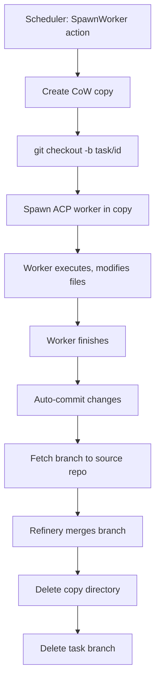

Enki gives each worker a **full filesystem copy** of your project at `.enki/copies/<task_id>`. Copies include everything — build artifacts, `node_modules`, `.gitignored files` — so workers start with a warm build cache. Uses platform-appropriate copy-on-write for instant, space-efficient clones.

## Why Full Copies?

**Workers need everything, not just source code.** If a test suite depends on compiled binaries, or a linter expects `node_modules`, workers must see those files. Enki's copy-on-write approach gives workers the entire project state without doubling disk usage.

<Note>
Copies are **independent**. Each worker modifies its own copy. When finished, changes are committed to a git branch, fetched back to the source repo, and merged. The source working tree is never directly modified by workers.
</Note>

## Copy-on-Write Cloning

Enki uses platform-specific CoW primitives:

- **macOS (APFS)**: `cp -Rc` — instant cloning via `clonefile(2)`
- **Linux (btrfs/XFS)**: `cp --reflink=auto -a` — CoW where supported, regular copy otherwise
- **Other**: `cp -a` — regular recursive copy

<Tip>
**Instant clones on modern filesystems**: On APFS and btrfs, cloning a 10GB project takes milliseconds and uses near-zero additional disk space until files are modified.
</Tip>

## Worker Filesystem Layout

Each worker gets a directory under `.enki/copies/`:

```
.enki/
├── copies/
│   ├── task-a1b2c3de/    # Worker copy for task-a1b2c3de
│   │   ├── src/
│   │   ├── build/        # Build artifacts included!
│   │   ├── node_modules/ # Dependencies included!
│   │   ├── .git/         # Full git history
│   │   └── ...
│   └── task-f4e5d6c7/    # Another worker's copy
└── db.sqlite
```

<Warning>
**`.enki/` is excluded** from worker copies. The database, event signals, and other copies are never visible to workers. This prevents nested copies and database conflicts.
</Warning>

## Copy Creation: Git vs Non-Git Projects

Enki handles both git-based projects and non-git directories.

### Git Projects

For projects that are git repositories:

1. **Record the base commit** (current `HEAD`) and branch name
2. **Clone each top-level entry** except `.enki/` into a temp directory using CoW
3. **Atomically rename** the temp directory to the final copy path
4. **Create a task branch** inside the copy: `git checkout -b task/<task_id>`

The worker branch starts at the same commit as the source repo, plus any uncommitted working tree changes (they're copied too).

### Non-Git Projects

For directories that aren't git repos (e.g., a folder of scripts):

1. **Clone each top-level entry** except `.enki/`
2. **Initialize git inside the copy**: `git init`, commit everything as a "baseline" commit
3. **Create a task branch** off the baseline: `task/<task_id>`

The worker still uses git for tracking changes, but the final merge copies files back instead of using git merge.

<Info>
**Why git inside non-git copies?** Workers use git for version control regardless of the source. This gives Enki a uniform interface: all changes are git commits, all merges follow the same flow (though non-git projects do filesystem merges instead of git merges).
</Info>

## Uncommitted Changes Are Visible

If you have uncommitted changes in your working tree, **workers see them**. Copies are created from the live filesystem, not from `HEAD`.

```bash
# You have uncommitted changes:
echo "WIP feature" > feature.rs
# (not committed)

# Worker copy sees feature.rs with "WIP feature"
```

<Tip>
This is intentional. If you're actively developing and want a worker to build on your WIP changes, they should see the current state. Commit first if you want workers to start from a clean `HEAD`.
</Tip>

## Worker Changes: Commit and Fetch

When a worker finishes:

1. **Auto-commit**: Enki runs `git add -A && git commit -m "<title>"` inside the copy
2. **Fetch branch**: `git fetch <copy_path> task/<id>:task/<id>` brings the worker's commits into the source repo
3. **Merge**: The refinery merges `task/<id>` into the default branch
4. **Cleanup**: Copy directory is deleted, branch is deleted from source

The source repo's working tree is **never directly modified**. All changes come through git branches.

<Accordion title="What if a worker makes no file changes?">
If the worker completes without committing any file changes, Enki reports `WorkerOutcome::NoChanges`. The task is retried (up to 3 times) or fails. Workers are expected to produce output.
</Accordion>

## Platform-Specific Behavior

Enki adapts to the platform's CoW capabilities:

| Platform | Command | CoW Support |
|----------|---------|-------------|
| macOS (APFS) | `cp -Rc` | ✅ Full CoW via clonefile |
| Linux (btrfs) | `cp --reflink=auto -a` | ✅ Full CoW |
| Linux (ext4) | `cp --reflink=auto -a` | ⚠️ Falls back to regular copy |
| Linux (XFS) | `cp --reflink=auto -a` | ✅ Full CoW (recent kernels) |
| Other | `cp -a` | ❌ Regular copy |

<Warning>
**ext4 does not support CoW**. On ext4 filesystems, copies are full recursive copies. For large projects, this can be slow and disk-intensive. Consider using btrfs or XFS for Enki workloads.
</Warning>

## Copy Lifecycle



## CopyManager API

The `CopyManager` struct (in `core/src/copy.rs`) handles all copy operations:

```rust
impl CopyManager {
    /// Create a copy for a worker. Returns (copy_path, base_commit, base_branch).
    pub fn create_copy(&self, task_id: &str) -> Result<(PathBuf, Option<String>, String)>;

    /// Auto-commit uncommitted changes in a copy. Returns true if a commit was created.
    pub fn commit_copy(&self, copy_path: &Path, message: &str) -> bool;

    /// Check if a copy has any file changes vs the base commit.
    pub fn has_changes(&self, copy_path: &Path, base_commit: Option<&str>) -> bool;

    /// Remove a copy directory.
    pub fn remove_copy(&self, copy_path: &Path) -> Result<()>;

    /// Fetch a worker's branch from a copy into the source repo.
    pub fn fetch_branch(&self, copy_path: &Path, branch: &str) -> Result<()>;

    /// Delete a branch from the source repo.
    pub fn delete_branch(&self, branch: &str) -> Result<()>;
}
```

## Git Identity

Copies inherit the user's git identity from the source repo:

```rust
pub struct GitIdentity {
    pub name: String,   // user.name
    pub email: String,  // user.email
}
```

Enki reads `user.name` and `user.email` from the source repo's git config on startup. All commits in worker copies use this identity.

<Info>
If the source isn't a git repo (or git config is missing), Enki uses a default identity: `"enki" <enki@localhost>`.
</Info>

## Example: Worker Copy Workflow

Here's a real workflow from start to finish:

```bash
# Source repo state:
HEAD=abc123 (on branch main)
Uncommitted: feature.rs (WIP)

# 1. Create copy for task-001
.enki/copies/task-001/  # CoW clone created (instant)
  # Contains: all source, build/, node_modules/, .git/, feature.rs
  # On branch: task/task-001

# 2. Worker runs, modifies files:
echo "impl" >> feature.rs
touch tests/test_feature.rs

# 3. Worker finishes, auto-commit:
git add -A
git commit -m "Implement feature"
# Now task-001 has 1 commit on task/task-001

# 4. Fetch branch to source:
cd <source>
git fetch .enki/copies/task-001 task/task-001:task/task-001
# Source now has branch task/task-001 with worker's commit

# 5. Refinery merges:
git merge task/task-001 --no-edit
# feature.rs and tests/test_feature.rs now in main

# 6. Cleanup:
rm -rf .enki/copies/task-001
git branch -D task/task-001
```

## Performance Characteristics

| Operation | APFS (macOS) | btrfs (Linux) | ext4 (Linux) |
|-----------|--------------|---------------|---------------|
| Create copy (10GB project) | ~100ms | ~200ms | ~30s |
| Disk usage (before modifications) | ~1MB (metadata) | ~1MB (metadata) | 10GB (full copy) |
| Worker modifies 10 files (1MB total) | +1MB | +1MB | +1MB |

<Tip>
**Best performance**: Use APFS on macOS or btrfs on Linux for near-instant clones and minimal disk overhead.
</Tip>

## Limitations and Trade-offs

<Warning>
**No file locking between copies**: Workers can't coordinate. If two workers modify the same file, one merge will conflict. This is by design — the refinery handles conflicts via the merger agent.
</Warning>

<Note>
**Build artifacts are shared (until modified)**: If you have a 5GB `target/` directory from a Rust build, all workers share those blocks via CoW until they rebuild. The first worker to modify a file triggers a copy of that file.
</Note>

## Next Steps

<CardGroup cols={2}>
  <Card title="Merge Queue" icon="code-merge" href="/concepts/merge-queue">
    Learn how the refinery merges worker branches
  </Card>
  <Card title="Roles" icon="user-tag" href="/concepts/roles">
    Understand agent roles and output modes
  </Card>
</CardGroup>