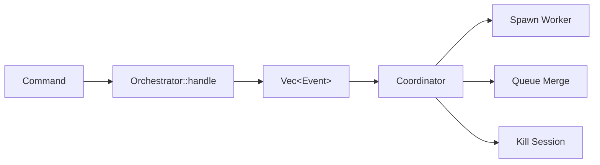
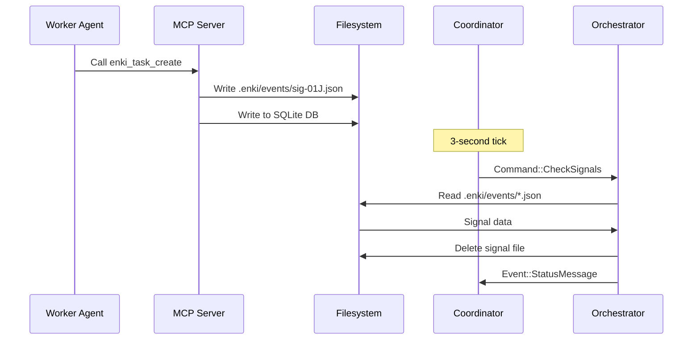
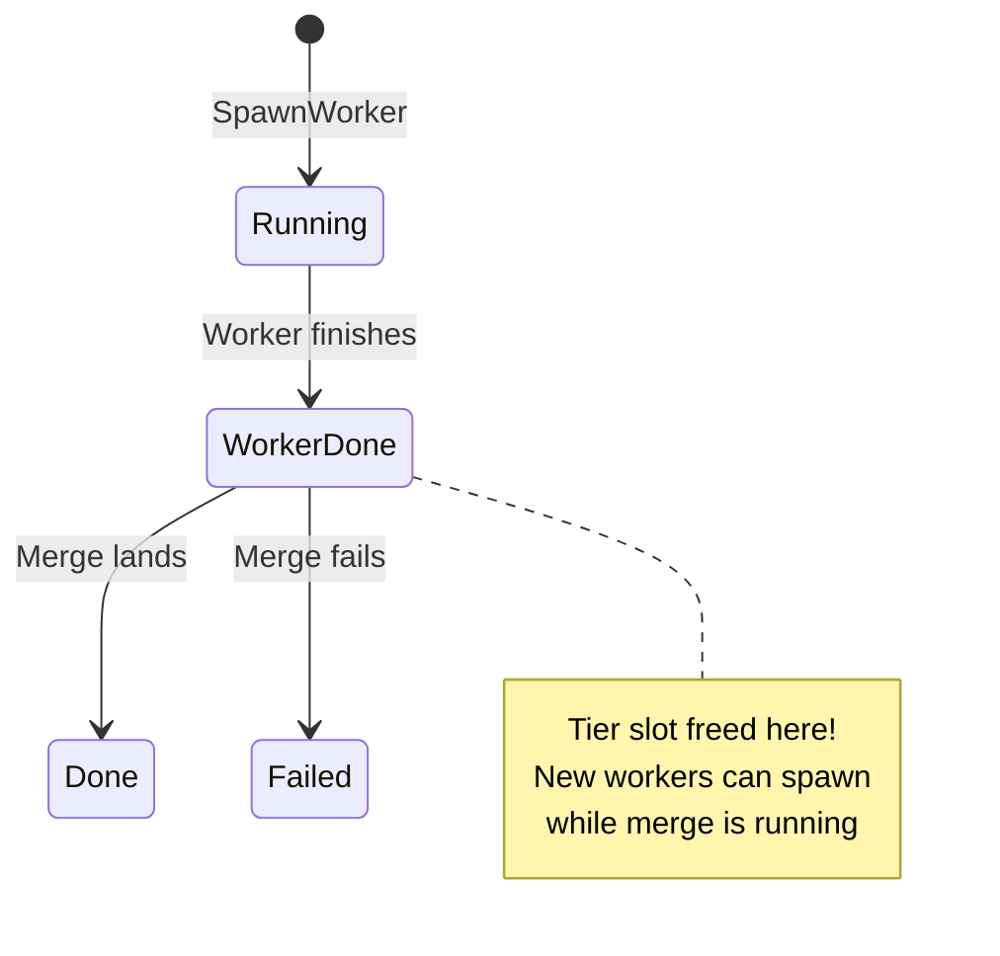
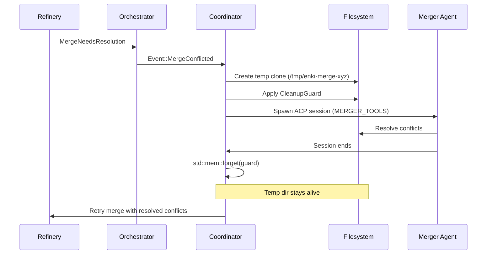
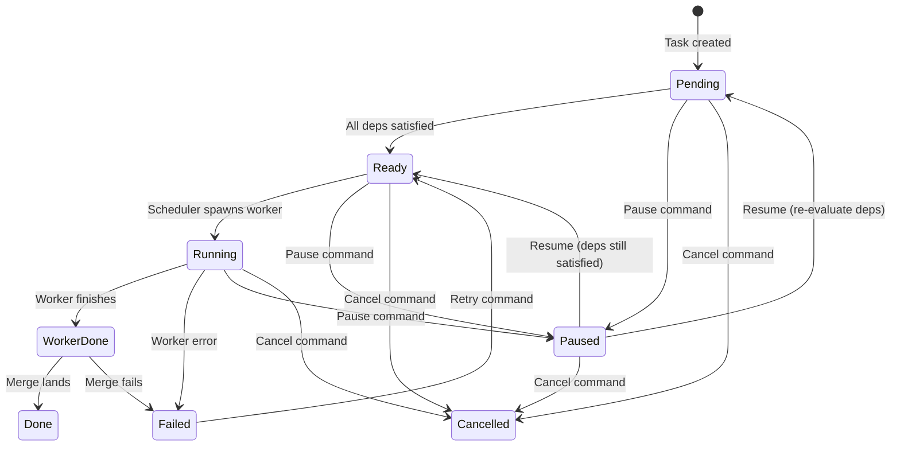

## Overview

Enki is built around **pure synchronous state machines** in the `core` crate, with a thin async coordinator layer in the `cli` crate. This design makes the orchestration logic trivially testable and easy to reason about.

### Core Design Principles

1. **DAG is the single source of truth** - Runtime decisions read from the in-memory DAG, not the database
2. **Synchronous state machines** - `Orchestrator`, `Scheduler`, `Dag`, and `MonitorState` are all pure sync types with no async/tokio
3. **Coordinator is a thin async adapter** - Translates between async events and `Command`/`Event` pairs
4. **Signal file IPC** - Cross-process communication via JSON files instead of sockets or pipes

## Crate Architecture

<Tabs>
  <Tab title="Dependency Graph">
    ```mermaid
    graph TD
        CLI[cli<br/>Binary + Coordinator] --> TUI[tui<br/>Terminal Rendering]
        CLI --> ACP[acp<br/>Agent Client]
        CLI --> CORE[core<br/>State Machines]
        ACP -.->|no dependency| CORE
        TUI -.->|no dependency| CORE
        
        style CORE fill:#4a90e2
        style CLI fill:#50c878
        style ACP fill:#f39c12
        style TUI fill:#9b59b6
    ```
    
    **Strict dependency direction**: `cli` → `tui`, `acp`, `core`. **No cycles**.
  </Tab>
  
  <Tab title="Crate Roles">
    | Crate | Async? | Purpose |
    |-------|--------|----------|
    | `core` | ❌ No | Pure sync state machines: Orchestrator, DAG scheduler, SQLite persistence, CoW copy manager, git merge refinery, roles, hashlines |
    | `acp` | ✅ Yes | Async ACP client. Spawns agent subprocesses, manages sessions. `!Send` types (`Rc<RefCell<...>>`), must run on `LocalSet` |
    | `tui` | ❌ No | Sync terminal UI over raw `crossterm`. Chat framework via `Handler<M>` trait |
    | `cli` | ✅ Yes | The `enki` binary. Houses coordinator loop: `tokio::select!` on dedicated OS thread with `current_thread` runtime + `LocalSet` |
  </Tab>
</Tabs>

## Command/Event State Machine Pattern

The `Orchestrator` exposes a pure functional interface:

```rust
pub enum Command {
    CreateExecution { steps: Vec<StepDef> },
    CreateTask { title, description, tier },
    WorkerDone(WorkerResult),
    MergeDone(MergeResult),
    RetryTask { task_id },
    Pause(Target),
    Resume(Target),
    Cancel(Target),
    StopAll,
    MonitorTick { workers },
    Recover,
    DiscoverFromDb,
    CheckSignals,
}

pub enum Event {
    SpawnWorker { task_id, tier, ... },
    KillSession { session_id },
    QueueMerge(MergeRequest),
    WorkerCompleted { task_id, title },
    WorkerFailed { task_id, error },
    MergeLanded { mr_id, task_id },
    MergeConflicted { mr_id, task_id },
    ExecutionComplete { execution_id },
    StatusMessage(String),
    // ...
}

impl Orchestrator {
    pub fn handle(&mut self, cmd: Command) -> Vec<Event> {
        // Pure state transition
        // No I/O, no async, no side effects
    }
}
```

**Key insight**: Every method is `fn handle(&mut self, cmd) -> Vec<Event>` — trivially testable, no mocking required.

### Command Processing Flow



## Sync vs Async Boundaries

<Warning>
**Critical Pattern**: All ACP code uses `Rc<RefCell<...>>`, making it `!Send`. The coordinator runs on its own OS thread with a `current_thread` runtime + `LocalSet`. **Never send ACP types across threads**.
</Warning>

### The Coordinator Thread

The `cli` crate spawns a dedicated OS thread for the coordinator:

```rust
// Simplified coordinator structure
std::thread::spawn(move || {
    let runtime = tokio::runtime::Builder::new_current_thread()
        .enable_all()
        .build()
        .unwrap();
    
    let local_set = tokio::task::LocalSet::new();
    
    local_set.block_on(&runtime, async move {
        // Coordinator event loop
        let mut orchestrator = Orchestrator::new(db);
        let agent_manager = AgentManager::new(); // !Send
        
        loop {
            tokio::select! {
                // Worker completion
                Some(result) = worker_rx.recv() => {
                    let events = orchestrator.handle(
                        Command::WorkerDone(result)
                    );
                    process_events(events, &agent_manager).await;
                }
                
                // Tick timer (3 seconds)
                _ = tick_interval.tick() => {
                    let events = orchestrator.handle(
                        Command::CheckSignals
                    );
                    process_events(events, &agent_manager).await;
                }
                
                // User input from TUI
                Some(msg) = tui_rx.recv() => {
                    // Handle user message
                }
            }
        }
    });
});
```

### Why `!Send`?

The ACP client uses `Rc<RefCell<...>>` for shared mutable state because:
1. All agent sessions run on the same thread (the LocalSet)
2. No need for the overhead of `Arc<Mutex<...>>`
3. Simpler code without cross-thread synchronization

**Consequence**: You can't `tokio::spawn` ACP types. Use `local_set.spawn_local()` instead.

```rust
// ❌ Wrong - compile error
tokio::spawn(async move {
    agent_manager.spawn_worker(task).await
});

// ✅ Correct
local_set.spawn_local(async move {
    agent_manager.spawn_worker(task).await
});
```

## Signal File IPC

Cross-process communication happens via JSON signal files in `.enki/events/`:



**Signal file format**:
```json
{"type": "execution_created", "execution_id": "exec-abc123"}
{"type": "task_created", "task_id": "task-def456"}
{"type": "pause", "execution_id": "exec-abc123", "step_id": "step-1"}
{"type": "cancel", "execution_id": "exec-abc123"}
{"type": "stop_all"}
```

**Why signal files instead of sockets?**
- Simple: no connection management, no ports
- Crash-safe: files persist across restarts
- Debuggable: human-readable JSON
- No fsnotify: 3-second polling is fast enough

## Two-Phase Worker Completion

<Warning>
**Critical pattern**: Worker completion happens in two phases to maximize concurrency.
</Warning>

### Phase 1: WorkerDone (frees tier slot)

When a worker finishes its task:
1. Coordinator sends `Command::WorkerDone(result)` to Orchestrator
2. Orchestrator transitions DAG node from `Running` → `WorkerDone`
3. Scheduler **immediately frees the tier slot**
4. Orchestrator returns `Event::QueueMerge` to start the merge

### Phase 2: MergeDone (advances DAG)

After the merge completes:
1. Coordinator sends `Command::MergeDone(result)` to Orchestrator
2. Orchestrator transitions DAG node from `WorkerDone` → `Done`
3. Scheduler **evaluates dependencies and spawns downstream tasks**



### Why Two Phases?

**Without two phases**: Tier slots remain occupied during merge, blocking other workers

**With two phases**: Merge runs in background while new workers spawn, maximizing parallelism

**Example**:
```
Tier limit: 3 standard workers

Time 0: Worker A, B, C running (3/3 slots)
Time 1: Worker A finishes → WorkerDone (2/3 slots, merge queued)
Time 2: Worker D spawns (3/3 slots)
Time 3: Worker A merge completes → MergeDone → spawns Worker E (if dependencies allow)
```

## process_events Cascade

<Warning>
Spawning a worker can fail and produce new events. The coordinator must drain events in a loop.
</Warning>

```rust
let mut events = orchestrator.handle(command);

while !events.is_empty() {
    let mut new_events = Vec::new();
    
    for event in events.drain(..) {
        match event {
            Event::SpawnWorker { task_id, tier, .. } => {
                // Try to spawn worker
                if let Err(e) = spawn_worker(task_id).await {
                    // Spawn failed, send WorkerFailed back
                    let failed_events = orchestrator.handle(
                        Command::WorkerFailed { task_id, error: e }
                    );
                    new_events.extend(failed_events);
                }
            }
            // Handle other events...
        }
    }
    
    events = new_events;
}
```

**Why a loop?**
- A `SpawnWorker` event can fail (disk full, copy error)
- The failure produces a `WorkerFailed` event
- That event might trigger cascading cancellations
- Those cancellations produce `StatusMessage` events

## infra_broken Flag

If `cp` fails during worker spawn (disk full, filesystem issue), the coordinator sets `infra_broken = true` and auto-fails all subsequent spawn attempts without retrying.

```rust
if infra_broken {
    // Skip spawn attempt, immediately fail
    let events = orchestrator.handle(
        Command::WorkerFailed {
            task_id,
            error: "Infrastructure broken".into(),
        }
    );
    return events;
}

// Try to create CoW copy
if let Err(e) = create_copy(task_id) {
    error!("Copy failed: {e}");
    infra_broken = true; // Prevent cascading retries
    
    let events = orchestrator.handle(
        Command::WorkerFailed { task_id, error: e }
    );
    return events;
}
```

**Why auto-fail?**
- Prevents spamming the logs with identical errors
- Fails fast instead of blocking the queue
- User can fix the issue and restart

## Copy-on-Write Mechanics

Each worker gets an isolated filesystem copy of the entire project:

```
Project root/
├── .enki/
│   └── copies/
│       ├── task-a1b2c3/   ← Full CoW clone for task A
│       │   ├── src/
│       │   ├── Cargo.toml
│       │   ├── target/     ← Includes build artifacts!
│       │   └── node_modules/ ← Includes dependencies!
│       └── task-d4e5f6/   ← Full CoW clone for task B
└── src/
```

### Platform-Specific Commands

**macOS (APFS)**:
```bash
cp -Rc source/ .enki/copies/task-abc/
```
- `-R`: Recursive
- `-c`: Use clonefile (instant CoW copy)

**Linux (btrfs/xfs)**:
```bash
cp --reflink=auto -a source/ .enki/copies/task-abc/
```
- `--reflink=auto`: Use CoW if supported, fallback to regular copy
- `-a`: Archive mode (preserves permissions, timestamps)

### Why Copy Everything?

**Including build artifacts** means workers start with a warm build cache:
- First worker does a full build (slow)
- Subsequent workers copy the `target/` directory (instant)
- Workers only rebuild changed files

**Exclusions**: `.enki/` itself is excluded from copies to prevent infinite recursion.

## Merge Conflict Resolution Flow

When a merge conflicts, Enki spawns a **separate merger agent** with minimal tools:



### CleanupGuard Pattern

```rust
struct CleanupGuard {
    path: PathBuf,
}

impl Drop for CleanupGuard {
    fn drop(&mut self) {
        fs::remove_dir_all(&self.path).ok();
    }
}

// Create temp clone
let temp_dir = PathBuf::from("/tmp/enki-merge-abc123");
fs::create_dir(&temp_dir)?;

let guard = CleanupGuard { path: temp_dir.clone() };

// Spawn merger agent
let merger = spawn_merger_agent(&temp_dir).await;

// Keep temp dir alive during resolution
std::mem::forget(guard);

// Merger works in temp_dir, resolves conflicts
merger.wait().await;

// Manually clean up after merge retry
fs::remove_dir_all(&temp_dir)?;
```

**Why `mem::forget`?**
- The merger agent needs the temp directory to stay alive
- Dropping the guard would delete it while the agent is working
- We forget the guard and manually clean up later

### Merger Tools (Minimal Set)

```rust
const MERGER_TOOLS: &[&str] = &[
    "read_text_file",
    "write_text_file",
    "bash",
    "complete_task", // Signal completion
];
```

**No editing tools** to prevent the merger from making unrelated changes.

## DAG Node States and Transitions



### Edge Conditions

Dependencies can specify **when** they're satisfied:

```rust
pub enum EdgeCondition {
    Merged,    // Default: dep must be Done (worker + merge complete)
    Completed, // Dep worker finished (WorkerDone or Done)
    Started,   // Dep just needs to be Running (or further)
}
```

**Example**: Tests can start as soon as implementation is running:

```rust
dag.add_edge("test", "impl", EdgeCondition::Started);

// impl transitions to Running → test becomes Ready
// impl doesn't need to finish or merge first
```

## Scheduler: Tier-Based Concurrency

The scheduler manages concurrency limits per complexity tier:

```rust
pub struct Limits {
    pub max_light: usize,    // e.g., 5 (haiku)
    pub max_standard: usize, // e.g., 3 (sonnet)
    pub max_heavy: usize,    // e.g., 1 (opus)
}
```

**Scheduler logic**:

```rust
pub fn tick(&mut self) -> Vec<SchedulerAction> {
    let mut actions = Vec::new();
    
    // Count active workers per tier
    let active = self.count_active_by_tier();
    
    // Find ready nodes across all executions
    for exec in &self.executions {
        for node in exec.dag.get_ready_nodes() {
            let tier = node.tier;
            
            // Check if we have capacity
            if active[tier] < self.limits[tier] {
                actions.push(SchedulerAction::Spawn {
                    task_id: node.task_id,
                    tier,
                });
                active[tier] += 1;
            }
        }
    }
    
    actions
}
```

**Fair scheduling**: Executions are evaluated round-robin to prevent starvation.

## Monitor: Worker Health

The `MonitorState` tracks worker liveness:

```rust
pub struct MonitorState {
    workers: HashMap<SessionId, WorkerInfo>,
    cancelled: HashSet<SessionId>,
    task_retries: HashMap<TaskId, usize>,
}

const STALE_CANCEL_SECS: u64 = 120; // 2 minutes
const MAX_TASK_RETRIES: usize = 3;
```

**Monitor tick logic**:

```rust
pub fn tick(&mut self, now: SystemTime) -> Vec<MonitorAction> {
    let mut actions = Vec::new();
    
    for (session_id, worker) in &self.workers {
        let idle_secs = now.duration_since(worker.last_activity).as_secs();
        
        if idle_secs > STALE_CANCEL_SECS {
            if !self.cancelled.contains(session_id) {
                actions.push(MonitorAction::Cancel(*session_id));
                self.cancelled.insert(*session_id);
            }
        }
    }
    
    actions
}
```

**Retry budget**: Tasks that fail are retried up to `MAX_TASK_RETRIES` times before blocking.

## Database: Write-Behind Persistence

<Warning>
The DAG is the single source of truth. The database is **write-behind** for crash recovery and external visibility.
</Warning>

**Schema (simplified)**:

```sql
CREATE TABLE executions (
    id TEXT PRIMARY KEY,
    status TEXT,
    dag TEXT,  -- JSON blob of the entire DAG
    created_at TEXT
);

CREATE TABLE tasks (
    id TEXT PRIMARY KEY,
    title TEXT,
    status TEXT,
    tier TEXT,
    copy_path TEXT,
    branch TEXT
);

CREATE TABLE merge_requests (
    id INTEGER PRIMARY KEY,
    task_id TEXT,
    branch TEXT,
    status TEXT,
    priority INTEGER
);
```

**Auto-migration** on every DB open:

```rust
pub fn auto_migrate(conn: &Connection) -> Result<()> {
    // Parse expected schema
    let expected = parse_schema(SCHEMA_DDL);
    
    // Get current schema
    let current = get_current_schema(conn)?;
    
    // Add missing columns
    for (table, columns) in expected {
        for col in columns {
            if !current[table].contains(&col) {
                conn.execute(
                    &format!("ALTER TABLE {} ADD COLUMN {}", table, col),
                    [],
                )?;
            }
        }
    }
    
    Ok(())
}
```

**No migration files, no downmigrations** — just parse the schema and add missing columns.

## Next Steps

<CardGroup cols={2}>
  <Card title="Setup Guide" icon="hammer" href="/development/setup">
    Get your development environment ready
  </Card>
  <Card title="Testing" icon="flask" href="/development/testing">
    Learn how to test state machines and debug issues
  </Card>
</CardGroup>