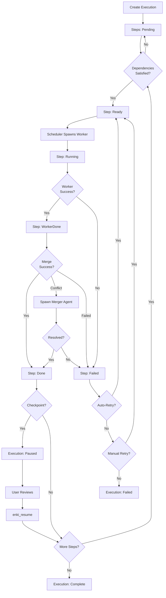

## What Are Executions?

Executions are **multi-step workflows** with dependency ordering managed by a DAG (directed acyclic graph). Each execution:

- Contains 2+ related steps (tasks)
- Tracks dependencies between steps ("B needs A to finish first")
- Enables parallel execution where dependencies allow
- Supports pausing/resuming at checkpoints
- Cascades cancellation through dependent steps

Think of executions as "projects" or "features" that decompose into coordinated tasks.

## Creating Executions

The coordinator agent creates executions using `enki_execution_create`:

```json
{
  "steps": [
    {
      "id": "scaffold",
      "title": "Create notification system structure",
      "description": "...",
      "tier": "light",
      "needs": []
    },
    {
      "id": "email_provider",
      "title": "Implement email notifications",
      "description": "...",
      "tier": "standard",
      "needs": ["scaffold"]
    },
    {
      "id": "sms_provider",
      "title": "Implement SMS notifications",
      "description": "...",
      "tier": "standard",
      "needs": ["scaffold"]
    },
    {
      "id": "tests",
      "title": "Write notification tests",
      "description": "...",
      "tier": "standard",
      "needs": ["email_provider", "sms_provider"]
    }
  ]
}
```

**Dependency graph:**

```
scaffold (ready)
  ├─ email_provider (pending)
  └─ sms_provider (pending)
       └─ tests (pending)
```

After `scaffold` completes and merges:

```
scaffold (done)
  ├─ email_provider (running)
  └─ sms_provider (running)
       └─ tests (pending)
```

Both `email_provider` and `sms_provider` run in parallel. When both complete, `tests` becomes ready.

## Dependency Conditions

By default, steps wait for dependencies to **merge** (branch lands on main). You can relax this with edge conditions:

### Merged (Default)

```json
"needs": ["scaffold"]
```

or explicitly:

```json
"needs": [{"step": "scaffold", "condition": "merged"}]
```

The step waits until the dependency's merge lands. Use for most dependencies where downstream work requires the code changes.

### Completed

```json
"needs": [{"step": "research", "condition": "completed"}]
```

The step waits until the worker finishes, but doesn't wait for the merge. Use when a step needs **knowledge or output** from upstream but not the merged code changes.

**Example:** A test step that needs the implementation worker to finish (to understand what was built) but can start before the merge completes.

### Started

```json
"needs": [{"step": "server", "condition": "started"}]
```

The step unblocks as soon as the dependency starts running. Use for truly independent steps that just need a predecessor to be underway.

**Example:** Running a linter or formatter in parallel with implementation work, where both can happen simultaneously.

<Warning>
Use `started` sparingly. Most steps should wait for `merged` or `completed` to avoid race conditions and ensure consistent context.
</Warning>

## Checkpoint Steps

Checkpoint steps pause the execution after completion for review and decision-making:

```json
{
  "id": "investigate_perf",
  "title": "Profile application performance",
  "description": "Run performance profiling under production load. Identify bottlenecks. Document top 3 slowest operations with flamegraphs.",
  "tier": "heavy",
  "checkpoint": true,
  "role": "researcher",
  "needs": []
}
```

When a checkpoint is reached:

1. **Worker completes** and produces output (artifact or branch summary)
2. **Merge lands** (if it's a code-producing worker)
3. **Execution pauses**—no new steps start, even if ready
4. **Coordinator notified** with the step's output:

   ```
   ✓ CHECKPOINT reached: step "investigate_perf" in execution exec-a1b2c3d4 completed.
     Output: Profiling revealed 3 hot spots: 1) JWT verification (40% CPU), 2) database N+1 queries in user list (30% time), 3) markdown parsing (20% CPU)

     The execution is now paused. Review the output, then either:
     - Call enki_execution_add_steps to add follow-up steps, then enki_resume to continue
     - Call enki_resume directly to continue with remaining steps
   ```

5. **You review findings** and decide next actions
6. **Add steps** (if needed) with `enki_execution_add_steps`:

   ```json
   {
     "execution_id": "exec-a1b2c3d4",
     "steps": [
       {
         "id": "fix_jwt",
         "title": "Cache JWT verification keys",
         "description": "...",
         "tier": "standard",
         "needs": ["investigate_perf"]
       },
       {
         "id": "fix_n_plus_one",
         "title": "Add eager loading to user list query",
         "description": "...",
         "tier": "standard",
         "needs": ["investigate_perf"]
       }
     ]
   }
   ```

7. **Resume** with `enki_resume` to continue execution:

   ```json
   {"execution_id": "exec-a1b2c3d4"}
   ```

### Use Cases for Checkpoints

- **Investigation-driven development**: Research first, implement based on findings
- **Phased rollouts**: Deploy phase 1, validate, then add phase 2 steps
- **Prototype approval**: Build POC, get user approval, then implement production version
- **Exploratory debugging**: Diagnose issue, confirm root cause, then fix

## Pausing and Resuming

Pause an execution to temporarily halt progress:

```json
{"execution_id": "exec-a1b2c3d4"}
```

This:

- Does NOT kill running workers (they continue until completion)
- Prevents new steps from starting
- Puts pending/ready steps into `paused` state

Resume to continue:

```json
{"execution_id": "exec-a1b2c3d4"}
```

Paused steps return to their original state (pending or ready) and scheduling resumes.

**Pause a single step:**

```json
{"execution_id": "exec-a1b2c3d4", "step_id": "tests"}
```

Only that step is paused. Other steps in the execution continue normally.

<Info>
Pausing does not affect currently running workers—it only prevents future steps from starting. To stop running workers, use cancellation.
</Info>

## Canceling Tasks

Cancel a step or entire execution to stop work and mark it as cancelled:

```json
{"execution_id": "exec-a1b2c3d4"}
```

This:

- **Kills running workers** for steps in this execution
- Marks all pending/ready/running steps as `cancelled`
- **Cascades to dependents**: Any steps depending on cancelled steps are also cancelled
- Marks the execution as `failed` (no longer progressing)

**Cancel a single step:**

```json
{"execution_id": "exec-a1b2c3d4", "step_id": "feature_x"}
```

Only that step (and its transitive dependents) are cancelled. Sibling steps continue.

### Pause vs. Cancel

| | Pause | Cancel |
|---|-------|--------|
| Running workers | Continue until completion | Killed immediately |
| Pending/ready steps | Can resume later | Marked cancelled (permanent) |
| Cascades to dependents | No | Yes |
| Execution status | Paused (temporary) | Failed (terminal) |

## Retry Behavior

### Automatic Retries

Certain failure types trigger automatic retries (up to 2 additional attempts):

- **Timeouts**: Worker exceeded stale threshold (120s for standard tier)
- **No changes**: Worker completed but made no file modifications (likely stuck or confused)

When auto-retry occurs:

```
✗ Worker failed: Implement feature X (a1b2): timeout: no activity for 120s
- Task "Implement feature X" (a1b2) timed out — retrying (1/2)
```

The orchestrator resets the task to `ready` and spawns a fresh worker.

### Manual Retry

For permanent failures (after exhausting auto-retries or other error types), use `enki_task_retry`:

```json
{"task_id": "task-a1b2c3d4"}
```

This:

- Resets the task to `ready` status
- Unblocks any sibling tasks that were blocked by this failure
- Restores the execution (if it was marked failed due to this task)
- Spawns a new worker when the scheduler ticks

<Tip>
Always diagnose failures using the session log excerpt before retrying. Blind retries waste time and credits. The coordinator will read logs automatically when failures occur.
</Tip>

### Retry Budget

Each task has a retry counter. After **3 total failures** (including auto-retries), the task is marked as **blocked** and requires manual intervention:

- Read the full session log at `~/.enki/logs/sessions/<label>.log`
- Identify the root cause (missing context, unclear description, codebase issue)
- Fix the underlying problem (adjust the task description, provide more context, fix broken code)
- Use `enki_task_retry` to add another attempt

Alternatively, cancel the execution and create a new one with an adjusted plan.

## Viewing Execution Status

Ask the coordinator for status updates:

```
What's the status of the notification system execution?
```

The coordinator will call `enki_task_list` and show:

- Execution ID
- Steps and their current status (pending, running, done, failed, paused, cancelled)
- Which workers are active
- Recent events (completions, merges, failures)

**System-wide status:**

```
Show me all tasks
```

The coordinator calls `enki_status` for counts by status:

```
Task Status:
- Pending: 3
- Running: 2
- Done: 7
- Failed: 1
```

And `enki_task_list` for details.

## Execution Lifecycle



## Adding Steps to Running Executions

Use `enki_execution_add_steps` to extend an execution dynamically:

```json
{
  "execution_id": "exec-a1b2c3d4",
  "steps": [
    {
      "id": "new_feature",
      "title": "Add feature Y based on checkpoint findings",
      "description": "...",
      "tier": "standard",
      "needs": ["research_step"]
    }
  ]
}
```

New steps:

- Can depend on existing steps (reference by step ID)
- Can depend on other new steps being added in the same call
- Follow normal dependency resolution (pending → ready → running)

This is commonly used after checkpoints to add follow-up work based on investigation results.

## Stopping All Workers

To immediately halt all running workers across all executions:

```
Stop all tasks
```

The coordinator calls `enki_stop_all`, which:

- Kills all active worker sessions
- Does NOT mark tasks as cancelled (they remain in their current state)
- Useful for emergency stops or when you need to reconfigure something

Tasks remain in the database and can be managed individually (cancel, retry, resume) after the stop.

## Best Practices

<AccordionGroup>
  <Accordion title="Use executions for multi-step work">
    Even for just 2 related tasks, prefer an execution over standalone tasks. You get:

    - Dependency tracking
    - Progress visibility
    - Ability to add steps later
    - Checkpoint support
  </Accordion>

  <Accordion title="Design for parallelism">
    Break work into steps that can run simultaneously:

    ```
    scaffold (light)
      ├─ auth (standard)
      ├─ profiles (standard)
      └─ search (standard)
    ```

    All three features run in parallel after the scaffold. This is faster than sequential work.
  </Accordion>

  <Accordion title="Use checkpoints for uncertainty">
    If you don't know the full plan upfront (research-driven work, exploratory debugging), use checkpoints:

    ```
    research → [CHECKPOINT] → (add steps based on findings) → implement
    ```
  </Accordion>

  <Accordion title="Retry with context">
    When a task fails, the coordinator reads the session log excerpt automatically. Always:

    1. Review the diagnosis
    2. Check if the task description was clear enough
    3. Add context if needed before retrying

    Don't blindly retry—understand why it failed first.
  </Accordion>

  <Accordion title="Cancel failed branches early">
    If a critical step fails and you need to pivot:

    1. Cancel the execution (stops dependent work)
    2. Create a new execution with the corrected plan

    Don't waste time retrying a flawed approach.
  </Accordion>
</AccordionGroup>